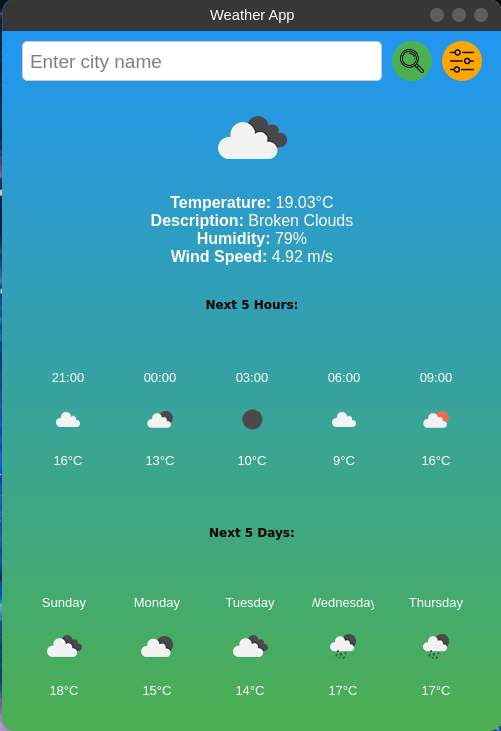

# Weather App

A simple and elegant weather application built with Python and PyQt5 that displays current weather information, a 5-hour forecast, and a 5-day forecast for a specified city. The application fetches data from the OpenWeatherMap API and updates automatically at a configurable interval. It now includes an in-app settings window for easy configuration.

## Table of Contents

- [Features](#features)
- [Demo](#demo)
- [Installation](#installation)
- [Configuration](#configuration)
- [Usage](#usage)
- [Dependencies](#dependencies)
- [Project Structure](#project-structure)
- [Contributing](#contributing)
- [License](#license)
- [Acknowledgments](#acknowledgments)

## Features

- **Current Weather Information**: Displays temperature, weather description, humidity, and wind speed.
- **5-Hour Forecast**: Shows weather conditions for the next 5 hours in 3-hour intervals.
- **5-Day Forecast**: Provides average daily temperature and weather conditions for the next 5 days.
- **In-App Settings Configuration**: Change API key, default city, and update interval directly from the application using the settings window.
- **Automatic Updates**: Refreshes weather data at intervals specified in the configuration file or settings window.
- **Customizable City**: Set a default city in the configuration file or search for any city using the input field.
- **Responsive UI**: Designed with a gradient background and scalable widgets for a pleasant user experience.
- **Configurable Refresh Rate**: Adjust the update interval through the settings window or configuration file without changing the code.

## Demo



## Installation

### Prerequisites

- Python 3.11 or higher
- pip package manager
- OpenWeatherMap API key (free registration)

### Clone the Repository

```bash
git clone https://github.com/lucaspinacosta/WeatherApp.git
cd WeatherApp
```

### Create a Virtual Environment (Optional but Recommended)

```bash
python -m venv venv
source venv/bin/activate  # On Windows: venv\Scripts\activate
```

### Install Dependencies

```bash
pip install -r requirements.txt
```

_Alternatively, manually install the required packages:_

```bash
pip install PyQt5 requests configparser
```

## Configuration

### Obtain an OpenWeatherMap API Key

1. Sign up at [OpenWeatherMap](https://openweathermap.org/) if you haven't already.
2. Navigate to the [API keys](https://home.openweathermap.org/api_keys) section in your account.
3. Generate a new API key or use an existing one.

### Initial Configuration

Create a `config.ini` file in the `config` directory with the following content:

```ini
[openweathermap]
api_key = YOUR_API_KEY

[default_city]
city_location = London

[refresh]
update_interval = 600  # Update interval in seconds (e.g., 600 seconds = 10 minutes)
```

- Replace `YOUR_API_KEY` with the API key obtained from OpenWeatherMap.
- Set `city_location` to your preferred default city.
- Adjust `update_interval` to the desired refresh rate in seconds.

**Note:** After the initial setup, you can change these settings directly within the application using the settings window.

## Usage

### Running the Application

```bash
python scripts/main.py
```

_Make sure you are in the root directory of the project and the virtual environment (if created) is activated._

### Using the Application

- **On Startup**: The app displays the weather for the default city specified in the configuration file or the settings.
- **Search for a City**:
  - Enter the name of a city in the input field.
  - Click the search button (magnifying glass icon) or press Enter.
  - The app updates to show weather information for the entered city.
- **Automatic Refresh**:
  - The app refreshes the weather data at intervals specified in `update_interval`.
  - You can adjust the interval through the settings window or by modifying the `config.ini` file.
- **Accessing Settings**:
  - Click the settings button (gear icon) next to the search button.
  - In the settings window, you can:
    - **Change API Key**: Update your OpenWeatherMap API key.
    - **Set Default City**: Specify a new default city.
    - **Adjust Update Interval**: Set a new refresh rate in seconds.
  - Click **Save** to apply changes. The app will update configurations and refresh the weather data.

## Dependencies

- **Python 3.11+**
- **PyQt5**: Python bindings for the Qt cross-platform application framework.
- **requests**: Library for making HTTP requests.
- **configparser**: Used for handling the configuration file.

Install all dependencies using:

```bash
pip install -r requirements.txt
```

## Project Structure

```
weather-app/
├── config/
│   └── config.ini
├── icons/
│   ├── research.png
│   └── settings.png
├── docs/
│   └── screenshot.png
├── scripts/
│   └── main.py
├── requirements.txt
└── README.md
```

- **config/**: Contains the configuration file `config.ini`.
- **icons/**: Holds icon images used in the application.
  - `research.png`: Icon for the search button.
  - `settings.png`: Icon for the settings button.
- **docs/**: Documentation and screenshots.
- **scripts/**: Holds scripts.
  - `main.py`: The main application script.
- **requirements.txt**: List of Python dependencies.
- **README.md**: This readme file.

## Contributing

Contributions are welcome! If you have suggestions or improvements, please open an issue or submit a pull request.

1. Fork the repository.
2. Create your feature branch: `git checkout -b feature/YourFeature`.
3. Commit your changes: `git commit -m 'Add some feature'`.
4. Push to the branch: `git push origin feature/YourFeature`.
5. Open a pull request.

## License

This project is licensed under the MIT License - see the [LICENSE](LICENSE) file for details.

## Acknowledgments

- **OpenWeatherMap**: For providing a comprehensive and free weather API.
- **PyQt5**: For the powerful GUI framework.
- **Icons8**: For the free icons used in the application.

---

_This application was developed to provide an easy and visually appealing way to access weather information. It demonstrates how to integrate APIs with a Python GUI application and how to structure code for readability and maintainability._

If you have any questions or need assistance, feel free to contact the project maintainer.
